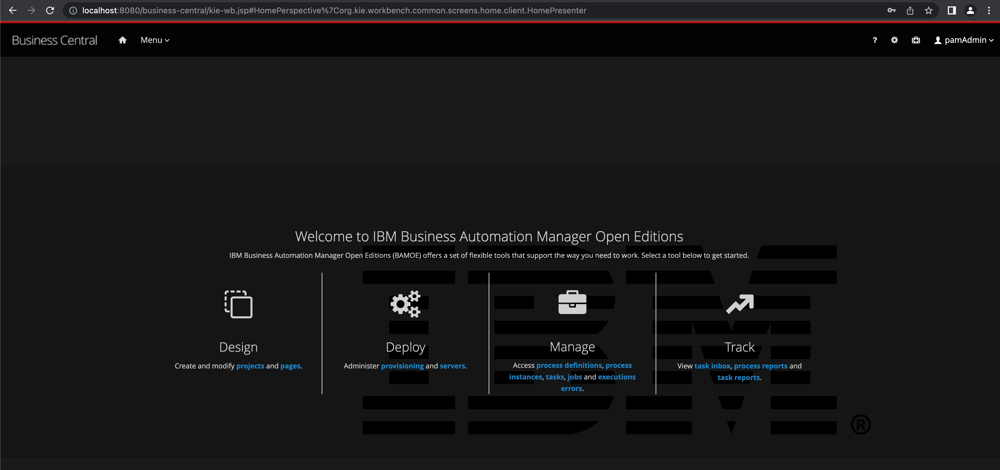

# IBM Business Automation Open Edition Installer in either local environments or as a Docker container

This repo is a sample way to deploy IBAMOE into various environments including as a single Docker container with both KIE Server and Business Central. This is for demo purposes only and should not be used as a production deployment basis. This environment has been tested with OpenJDK 11 in Windows, Mac and Fedora. For Docker this was built on the Universal Basic Image with OpenJDK 11.

*Please open any issues you have with this, fork/pull request, however you can contribute to the Open Source Community!*

IBM Business Automation Manager Open Edition Install Demo
=================================================
Project to automate the installation of this product without preconfiguration beyond a single admin user.

You can install this project on your own machine or on an OpenShift Container Platform.

The enviromments that will see the most development and new features for IBM Business Automation Manager Open Edition (IBAMOE) will be to focus on VSCode, KIE Sandbox and Kogito deployments. Demos focusing on these environments will be coming over the next few months so stay tune!

Installing on local machine deployed on A JBoss EAP environment
---------------------------
1. [Clone this repo](https://github.com/timwuthenow/ibamoe-docker.git).
   
2. Add products to installs directory, see [installs/README](installs/README.md) for details and links. These will be downloaded from Passport Advantage.

3. Run 'init.sh' or 'init.bat' file. 'init.bat' must be run with Administrative privileges.

Follow install output instructions and log in to http://localhost:8080/business-central (u:bamAdmin / p:ibmpam1!)

Deploying as a Docker container
---------------------------

There is a docker setup found in the [docker](https://github.com/timwuthenow/ibamoe-docker/tree/main/docker) directory. The installs directory in this subfolder will need to be populated with the downloads from your preferred download location for EAP 7.4, Business Central and KIE Server - this will be updated later to utilize the same directory, but for v0.1 it will not. This is to just run the Business Central and KIE Server environments as a single container. The way it is constructed now there is *no* persistent storage attached to it at this time. What this means is everytime the container is shutdown, the entire storage volume is lost. If you want to maintain this, you will need to add a persistent volume per Docker instructions. *This setup is not built as is for production and modifications would be required to do so, but can be used to try to deploy it into different Cloud environments and try out some of the tooling. There will be a container deployment of KIE Sandbox coming soon too.*

*When it comes to customizing/hardening the image, that is something a consulting team should be involved for, be it Client Engineering or Expert Labs. This was built by a Technical Sales Solution Architect, so your Organizations best practices are definitely not being used.*

1. To run the Docker build, you would go to [the subdirectory docker](https://github.com/timwuthenow/ibamoe-docker/tree/main/docker) and run `init-docker.sh` which will build both the Dockerfile and the image itself. You will need a Red Hat Service registry account [here](https://access.redhat.com/terms-based-registry/) to pull the Universal Basic Image (UBI)- a UBI from Dockerhub with OpenJDK11 (or preferred registry) could also possibly be used.
2. After it is completed, run the command found in the script `docker run -it -p 8080:8080 -p 9990:9990 ibamoe-8-bc` to run the image (replacing ibamoe-8-bc with the value found in your `DOCKERNAME` value in `init-properties.sh`
3. Access your infrastructure at:
a. _Business Central_: **host**:8080/business-central
b. _KIE_SERVER_: **host**:8080/kie-server/docs for Swagger-ui

User Name and password are bamAdmin/ibmpam1!

Try it out and provide feedback!
---------------------------
Enjoy the installed and configured IBM Business Automation Manager Open Edition 8. If you need more help, contact [Tim Wuthenow](tim.wuthenow@ibm.com).

COMING Q42022
Installing on any OpenShift Container Platform (generic)
-------------------------------------------------------
This demo can be installed on your own version of OpenShift Container Platform. Options and guidance can be found 
in [openshift support directory README](support/openshift/README.md).

- MORE TO COME SOON!

Released versions
-----------------
See the tagged releases for the following versions of the product:
- v0.1 - IBM Business Automation Manager Open Edition 8.0 GA

This is based off the original RHPAM Installation repository found here: https://github.com/jbossdemocentral/rhpam7-install-demo.git
